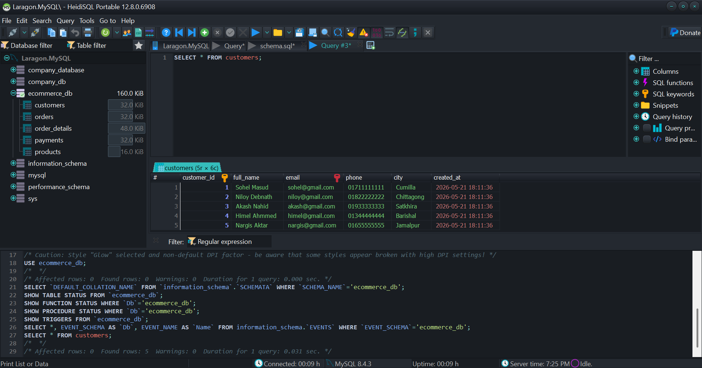

# MySQL Company Employee Database Project
## Project Overview

This project demonstrates hands-on MySQL database operations using a Company Employee Management System developed and tested in Laragon.

The main objective of this project is to practice real-world SQL queries and strengthen database management and database testing skills for Software Quality Assurance (SQA) learning.

In this project, various SQL operations were performed including:

- Database creation
- Table creation
- Data insertion
- Data retrieval using SELECT queries
- Data updating and deletion
- Filtering and sorting records
- Aggregate functions
- SQL joins
- Real-time table operations

This project also helped improve practical understanding of:

- SQL query writing
- Database structure design
- CRUD operations
- Query execution and validation
- Data consistency checking
- Database testing concepts
- GitHub project documentation

The project environment was managed using Laragon and MySQL on Windows.

## Technologies Used

- MySQL
- Laragon
- SQL
- Git
- GitHub

## Project Structure

```text
database/
screenshots/
docs/
README.md
```
## Screenshots

### Table Creation



## How to Run

1. Install Laragon
2. Start MySQL service
3. Create database
4. Run schema.sql
5. Run insert_data.sql
6. Execute query files

## Conclusion

This project provided practical experience in working with MySQL databases and performing real-world SQL operations using the Company Employee Management System. Through this project, important database concepts such as database creation, table management, CRUD operations, filtering, sorting, aggregate functions, and SQL joins were successfully practiced and implemented.

The project also helped strengthen understanding of database testing concepts including data validation, query verification, and maintaining data consistency. Using Laragon as the local development environment improved hands-on experience with managing and executing SQL queries in a professional workflow.

Overall, this project enhanced practical SQL knowledge, problem-solving ability, and project documentation skills while also building a strong foundation for future learning in Software Quality Assurance (SQA), database testing, and backend data management.