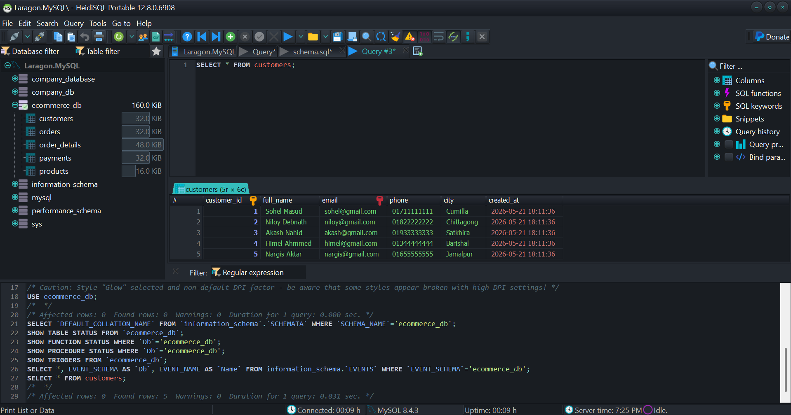

# E-commerce Web Application Database Project (MySQL)
## Project Overview

This project demonstrates hands-on MySQL database operations using a demo e-commerce web application’s customer and product management system, developed and tested in Laragon.

The main objective of this project is to practice real-world SQL queries and strengthen database management and database testing skills for Software Quality Assurance (SQA) learning.

In this project, various SQL operations were performed including:

- Database creation
- Table creation
- Data insertion
- Data retrieval using SELECT queries
- Data updating and deletion
- Filtering and sorting records
- Aggregate functions
- SQL joins
- Real-time table operations

This project also helped improve practical understanding of:

- SQL query writing
- Database structure design
- CRUD operations
- Query execution and validation
- Data consistency checking
- Database testing concepts
- GitHub project documentation

The project environment was managed using Laragon and MySQL on Windows.

## Technologies Used

- MySQL
- Laragon
- SQL
- Git
- GitHub

## Project Structure

```text
database/
screenshots/
docs/
README.md
```
## Screenshots

### Table Creation



## How to Run

1. Install Laragon
2. Start MySQL service
3. Create database
4. Run schema.sql
5. Run insert_data.sql
6. Execute query files

## Conclusion

The project focused on gaining practical experience with MySQL databases through the Web E-commerce Management System. Key database concepts were practiced, such as database creation, table management, CRUD operations, and SQL joins. It also emphasized database testing concepts like data validation and query verification. Using Laragon as a local development environment enhanced the experience of managing SQL queries. Overall, the project improved SQL knowledge, problem-solving skills, and documentation abilities, laying a solid foundation for future learning in Software Quality Assurance, database testing, and backend data management.